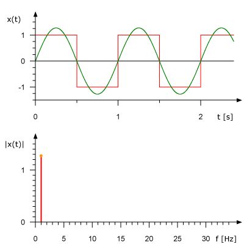

COMP 128 Audio Fingerprinter!
==========================

For this homework assignment, you will implement an audio recognition program that is similar in style to the Shazam app or what happens when you ask Siri/Alexa to identify a song.
The application works by first analyzing a directory of songs and creating digital fingerprints (e.g. a hash code) for each one. These fingerprints are
stored in a map to allow fast lookups. Once the map is created, your application will allow you to either load a song clip or listen
with your computer's microphone. The recorded sounds will be fingerprinted and compared to existing songs in the map to identify the
song that was played.

Your finished program will look like:


There are several learning goals for this assignment:
- Gain experience reading, understanding, and implementing algorithms 
- Practice using map data structures and understanding an interesting use of hashing
- Work on the skill of reading/understanding existing code and how to modify it.
- Continue building your programming skills


## Background Information and Recognition Algorithm

The following sections detail critical background information needed to understand the audio recognition algorith.

### Audio As a Wave

Sounds that we hear are caused by vibration that propogates as a wave of pressure through the air. Recording devices can convert the vibrations into an electrical wave signal with specific amplitudes and frequency. The higher the frequency of the wave, the higher the pitch  of the sound. The higher the amplitude of the wave the louder the sound.


Image Source: [https://theory.labster.com/sound-properties-dbs/](https://theory.labster.com/sound-properties-dbs/)

Your computer does not usually handle continuous waveforms of sound data. Instead, it usually uses buffers containing **sampled audio**: arbitrary sound data expressed as specific numbers, in this assignment an array of bytes (A byte is 8 bits --- zero's or ones encoding a value in the binary number system). Each byte in the array represents the amplitude at one moment in time, and the different array indices represent time steps of 1/44100th of a second. This is called **discrete sampling**.

### Time Domain vs. Frequency Domain

The discrete sampling described above represents data in the **Time Domain**. Each sample at an array index represents a specific amplitude of the wave at a moment in time. Often for signal processing, it is useful to analyse the data in the **Frequency Domain**. The image below shows an example of two different sounds waves with the corresponding graph of the frequency.


Sound waves like the square box wave shown below can be created by combining multiple sine waves of different frequencies. An algorithm called the Fast Fourier Transform (FFT) is used to convert the time-domain representation, shown in red, to the frequency-domain representation, shown in blue on the right. The component frequencies, spread across the frequency spectrum, are represented as peaks in the frequency domain.

 
Left Image Source: René Schwarz, CC BY-SA 3.0 via Wikimedia Commons

### Audio Fingerprinting

The key idea with music recognition is to create a unique "fingerprint" that identifies a song based on its frequencies. When trying to identify a sound clip, we can match the clip's fingerprint against a database of song fingerprints to determine a matching song.

If we just converted a song to the frequency domain, we would have all the frequencies and their magnitudes, but no correspondence to when they happen in the song. That would not let you match a shorter clip of the song to the entire song.Instead, we'll divide the original song wave into smaller chunks of 4096 bytes (4kb), each representing about a 10th of a second of sound, and convert each individual time chunk into the frequency domain.

#### Determining Keypoints

Each time chunk of the song in the frequency domain will contain many frequencies. For determining the audio fingerprint, we only care about the most important frequencies, i.e., the ones with the highest magnitude, the peaks. We will call these the keypoints for the time chunk.

Each time chunk will have four keypoint frequencies corresponding with the frequency with the highest magnitude in each of the following frequency ranges: [40 Hz - 80 Hz) and [80 Hz - 120 Hz) for the low tones (covering bass guitar, for example), and [120 Hz - 180 Hz) and [180 Hz - 300 Hz) for the middle and higher tones (covering vocals and most other instruments). Note that the '[' means the end value frequency is included, and '(' means that it is excluded. This keypoint information forms a signature for this chunk of the song, and this signature becomes part of the fingerprint of the song as a whole.

#### Hashing Keypoints

We want to be able to match the keypoints of a sound clip **quickly** to possible song keypoints. We can do that with the power of hashing and maps!

First convert the keypoints (highest frequencies in each range) for each time chunk into a single hash value. The [original Shizam algorithm](https://www.ee.columbia.edu/~dpwe/papers/Wang03-shazam.pdf) uses a fairly complex hash function. To simplify things we will use the one below:

```java
private static final int FUZ_FACTOR = 2;

private long hash(long p1, long p2, long p3, long p4) {
    return (p4 - (p4 % FUZ_FACTOR)) * 100000000 + (p3 - (p3 % FUZ_FACTOR))
            * 100000 + (p2 - (p2 % FUZ_FACTOR)) * 100
            + (p1 - (p1 % FUZ_FACTOR));
}
```

To make for easy audio search, this hash signature becomes the key in a HashMap. The corresponding value is the time this set of frequencies appeared in the song, along with the song Id. Filling in the map with the data from a collection of songs builds up a database we can use for song identification.

#### Song Identification Matching

To identify a song that is currently playing, we record a clip of the song, and run the recording through the same audio fingerprinting process as above. Then we can start searching the map for matching hash tags for each time chunk.

Many of the hash tags will correspond to the music identifier of multiple songs. For example, it may be that some piece of song A sounds exactly like some piece of song B (See [Axis of Awesome - Four Chord Song](https://www.youtube.com/watch?v=5pidokakU4I)). So we need to take into account the timing information as well.

Since the sound clip we are trying to recognize might not start at the beginning of a song, we need to use relative timings. An important insight is that if you calculate a time offset by subtracting the current time (i.e, the index) of the time chunk you are currently trying to recognize from the time for a matching hash in the database, sequential matches for a song will all have the same offset.


In the example above, the song we are trying to match has the following offset matches:

| Song Id | Offset | Number of Matching |
| :---: | :---: | :---: |
| A | 0 | 1 |
|   | 3 | 5 |
|   | 8 | 1 |
| B | 1 | 1 |
|   | 8 | 2 |

When we report the number of matches the output would look like:

| Song Matches: |
| :--- |
|`Song A: with 5 matches`|
|`Song B: with 2 matches`|

Note, how only the highest number of sequential matches is reported and the songs are in decending sorted order (Hint: go back and look at the Student Sorting Activity and the Comparable Interface).

## Getting Started and Tasks

To get started, read and study the background information above to understand the algorithm.

This repository has included code to display a user interface and get you started. The user interface code uses a library called JavaFX rather than KiltGraphics to draw the UI. Because of this, to run the MainApp application, you will need to download the VS Code Gradle extension.

1. Click the extensions icon in the left menu in VS Code (the one that looks like four cubes).
2. In the search box, search for "Gradle for Java" and install the extension.
3. To run the main app, click on the elephant icon in the left menu. Expand the Tasks > Application sections and click the play button next to "run".


### Task 0: Getting to know the existing code

Read through the existing code and make sure you understand how the different classes and methods work together. In particular,
there are two classes you will work closely with:

`SongDatabase` represents the database of songs that you will match against. It contains methods for reading in the audio data and converting it to the frequency domain using the fast fourier transform. Inside the res/music folder, we have included some songs you can use to load into the database. These songs are licensed under the Creative Commons Music license by Jason Shaw on [Audionautix.com](https://audionautix.com/)

`AudioFingerprinter` is an interface that you will need to implement in your own class. It specifies the method decomposition needed to fingerprint and recognize a song.

Before you continue, you should answer the following questions. We won't collect your answers for this assignment, but if you have questions on whether you understand the algorithm correctly then you should come to office hours to discuss it with your preceptors or professor.

1. In your own words, describe a general overview of the steps that need to be accomplished in order to recognize a song.
2. What is the purpose of the `DataPoint` class and its relationship to the `matcherDB` instance variable in the `SongDatabase` class? 
3. Why does the `matcherDB` object contain a List of DataPoints as the value rather than a single DataPoint?
4. In the matching algorithm, why is it not enough to just count datapoints that have the same hash as a match? 
5. The `convertToFrequencyDomain` method returns a 2D array of doubles. How is the data in this array organized and how would you calculate the magnitude for a specific frequency from it?
6. What is the role of the FUZ_FACTOR variable in the hash function above? What effect does it have on the hashes and why might we want to use it for this application?

### Task 1: 

Create a new Java class that implements the `AudioFingerprinter` interface. Your class will likely need to take a `SongDatabase` object 
as a parameter to the constructor to initialize an instance variable. Look carefully at the javadoc comments in the interface 
to make sure you are implementing each method correctly.

You can run the tests to determine whether the keypoints and hash methods are working correctly. You will need to initialize the audioFingerPrinter variable in the TODO at the top of the file.

### Task 2:

Complete the `processAudioData` method in the `SongDatabase` class. This method is used to analyze each song to create a database of fingerprints.

### Task 3:

Test your code using the `SimpleFingerprinter` class. You will need to initialize the `AudioFingerprinter rec` variable to an instance of your implementing class.

The CarolOfTheBells mp3 that is included in the music directory should have somewhere between 980-1000 matches. Make sure the results are returned in sorted order as specified in the interface definition. The number of matches may vary somewhat each time you run it because when the mp3 file is loaded the format is converted from a stereo file to mono which can lead to some numerical imprecision. The `AudioFingerprinterTest.testRecognize()` method uses pre-converted files containing just the raw bytes to avoid this issue. Make sure that it passes the test.

Once `SimpleFingerprinter` is working, complete the TODO comment in the MainApp class. You should now be able to run the MainApp using the process described above under the Getting Started section.


### Submission:

Make sure to commit and push, then check on github that everything is uploaded correctly.

As always, please make sure to follow the guidelines for [good java style](https://docs.google.com/document/d/1GT207Pia0q7bETKrqSi--C3X7N_67XgRXYEvQFrwHdI/edit?usp=sharing) that we have shared with you in the past.


